# Data Bridge Uploader - Flow Diagram

```mermaid
flowchart TD
    %% Start and Configuration
    Start([Start Application]) --> Config[Parse Command Line Flags]
    Config --> Validate[Validate Bucket Connectivity]
    Validate --> |Success| Init[Initialize Components]
    Validate --> |Failure| Error[Exit with Error]
    
    %% Component Initialization
    Init --> Compressor{Select Compressor}
    Compressor --> |cjxl| Cjxl[Shell out to cjxl]
    Compressor --> |libjxl| Libjxl[Native libjxl]
    Init --> S3Config[Configure S3 Uploader]
    S3Config --> |Options| S3Opts[Transfer Acceleration MRAP Support Part Size Concurrency]
    
    %% File Discovery and Batching
    Init --> FileScan[Scan Input Directory]
    FileScan --> Filter[Filter PNG Files]
    Filter --> BatchSize{Initial Batch Size}
    BatchSize --> |Default| DefaultBatch[200 files]
    BatchSize --> |Custom| CustomBatch[User-specified size]
    
    %% Main Processing Loop
    DefaultBatch --> MainLoop{More Files?}
    CustomBatch --> MainLoop
    MainLoop --> |Yes| CreateBatch[Create New Batch]
    MainLoop --> |No| Finalize[Finalize Uploads]
    
    %% Batch Processing
    CreateBatch --> CompressStage[Compression Stage]
    CompressStage --> CompressFiles[Compress Files in Batch]
    CompressFiles --> CompressComplete[Batch Compression Complete]
    
    %% Auto-tuning Logic
    CompressComplete --> AutoTune{Auto-tuning Enabled?}
    AutoTune --> |Yes| MeasureTime[Measure Compression Time]
    AutoTune --> |No| QueueBatch[Queue Batch for Upload]
    
    MeasureTime --> AdjustBatch{Compression Fast?}
    AdjustBatch --> |Yes| IncreaseBatch[Increase Batch Size]
    AdjustBatch --> |No| DecreaseBatch[Decrease Batch Size]
    AdjustBatch --> |Stable| KeepBatch[Keep Current Size]
    
    IncreaseBatch --> QueueBatch
    DecreaseBatch --> QueueBatch
    KeepBatch --> QueueBatch
    
    %% Upload Processing
    QueueBatch --> UploadQueue[Upload Queue - Capacity: 10]
    UploadQueue --> UploadStage[Upload Stage]
    
    %% Parallel Upload Processing
    UploadStage --> ParallelUpload{Upload Parallel > 1?}
    ParallelUpload --> |Yes| ParallelFiles[Upload Files in Parallel within Batch]
    ParallelUpload --> |No| SequentialFiles[Upload Files Sequentially]
    
    ParallelFiles --> MultipartUpload[Multipart Upload Part Size & Concurrency]
    SequentialFiles --> MultipartUpload
    
    %% Upload Configuration
    MultipartUpload --> S3Features{S3 Features}
    S3Features --> |Transfer Acceleration| Accel[Use S3 Transfer Acceleration]
    S3Features --> |MRAP| MRAP[Use Multi-Region Access Point]
    S3Features --> |Standard| Standard[Standard S3 Upload]
    
    Accel --> UploadComplete[Upload Complete]
    MRAP --> UploadComplete
    Standard --> UploadComplete
    
    %% Progress and State Management
    UploadComplete --> Progress[Update Progress]
    Progress --> StateSave[Save State to File]
    StateSave --> MainLoop
    
    %% Finalization
    Finalize --> WaitUploads[Wait for All Uploads]
    WaitUploads --> Summary[Generate Summary]
    Summary --> End([End])
    
    %% Error Handling
    Error --> End
    
    %% Styling
    classDef startEnd fill:#e1f5fe,stroke:#01579b,stroke-width:2px
    classDef process fill:#f3e5f5,stroke:#4a148c,stroke-width:2px
    classDef decision fill:#fff3e0,stroke:#e65100,stroke-width:2px
    classDef compression fill:#e8f5e8,stroke:#1b5e20,stroke-width:2px
    classDef upload fill:#fff8e1,stroke:#f57f17,stroke-width:2px
    classDef error fill:#ffebee,stroke:#c62828,stroke-width:2px
    
    class Start,End startEnd
    class Config,Init,FileScan,Filter,CreateBatch,CompressComplete,QueueBatch,UploadComplete,Progress,StateSave,Finalize,WaitUploads,Summary process
    class Compressor,BatchSize,MainLoop,AutoTune,AdjustBatch,ParallelUpload,S3Features decision
    class CompressStage,CompressFiles,Cjxl,Libjxl compression
    class UploadStage,ParallelFiles,SequentialFiles,MultipartUpload,Accel,MRAP,Standard,UploadQueue upload
    class Error error
```

## Key Features Illustrated

### **🔄 Batch Processing Flow**
- **Dynamic Batch Sizes**: Starts with default (200) or user-specified size
- **Auto-tuning**: Adjusts batch size based on compression performance
- **Queue Management**: 10-batch upload queue for resilience

### **⚡ Compression Options**
- **cjxl**: Shell out to command-line tool
- **libjxl**: Native C library integration
- **Lossless**: Medical image preservation guaranteed

### **🚀 Upload Flexibility**
- **Parallel Processing**: Multiple files per batch
- **Multipart Upload**: Configurable part size and concurrency
- **S3 Features**: Transfer Acceleration, MRAP support

### **🛡️ Resilience Features**
- **State Persistence**: Resume capability with JSONL state file
- **Error Handling**: Graceful failure with clear messages
- **Progress Tracking**: Real-time feedback and statistics

### **🎯 Auto-tuning Logic**
- **Performance Monitoring**: Measures compression time per batch
- **Adaptive Adjustment**: Increases/decreases batch size based on performance
- **Stability**: Maintains optimal batch size when performance is stable
